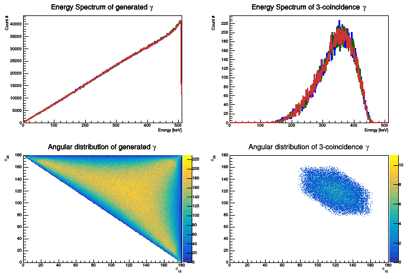

# Three-Body (Photon) Decay Simulation Program

## Description

This code allows the simulation of photon decay from orthopositronium state. Ortho-Positronium system decay into three photons.

[]

These plot are obtained by a simulation of 10E6 events.

## Code Structure

### Photon Class

This class characterize each photon with the usual observable:
* Momentum Vector
* Energy

### Event Class

This class handle event generator. A physical event is generated using the following "algorithm":

1. Sample the theoretical energy distribution of photon from o-Ps decay the energy for the first photon is obtained.
2. Sample a random point on a sphere surface for the purpose of obtaining the direction for momentum versor.
3. Scaling momentum vector according to the sampled energy.
4. Repeat 1-3 for the second gamma.
5. By imposing momentum conservation obtaining the third gamma momentum vector.
6. From previously obtained vector derive energy.
7. Sum the energy of all of the gammas and check the energy conservation.

### Detector Class
The detector class implement only one type of detector: Cylindrical Detectors. 
The detectors are characterized by the following members:
* Position Vector: vector pointing to the centre of detector face.
* Radius
* Half-aperture

In order to check if a gamma impinges onto a detector the angle between detector position vector and the gamma momentum vector has to be less than the half-aperture.

### Experimental Setup Class

This class handle the experimental setup and allows for the positioning of our detectors. In order to make this operation easy the detector copy constructor implement a Copy Constructor that allows the copy of a previously generated detector rotated by an angle Theta around a given axis.

### Run Manager

This class manage all the other and output all interesting physical plot and statistics.
Run Manager class is not general but up to now work only for our experimental setup and task.

## Compile

In order to compile this program you need the following library:

* ROOT 6
* Armadillo C++

then you can compile it using:

`./Compile`

## Usage

You can specify the number of events to be generated as follow:

`./sim *number_of_events_to_be_generated*`
